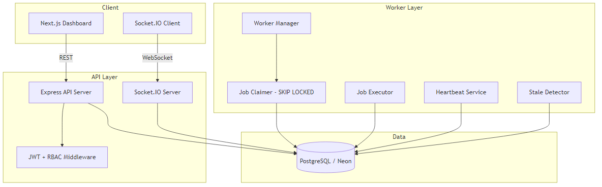
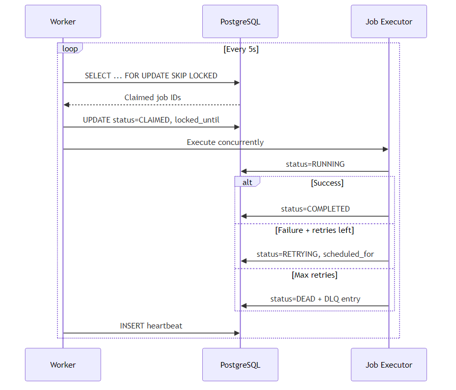
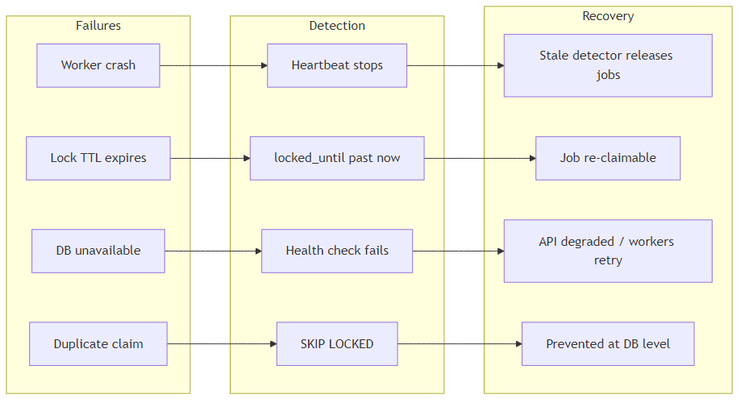
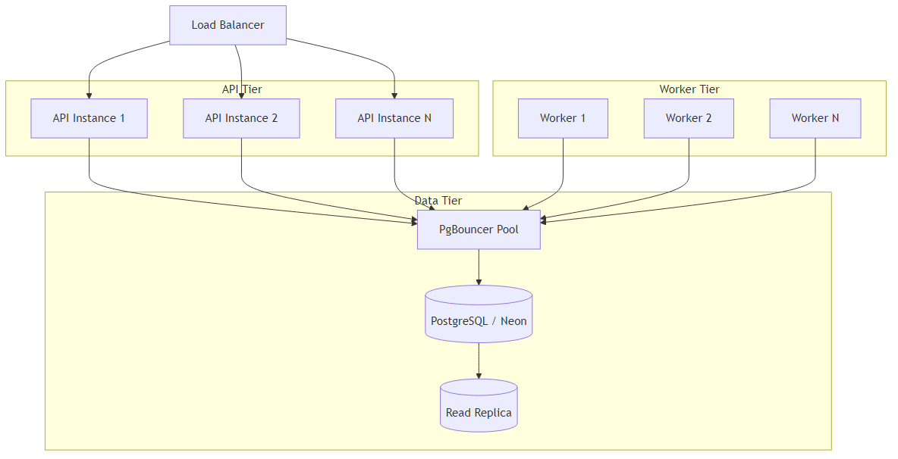
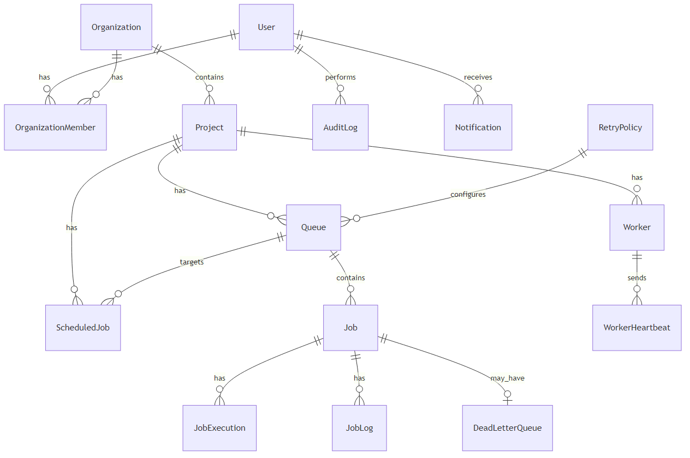

# Architecture Document — Codity v2

> **PDF export:** Diagrams below are embedded as images so they render correctly in PDF.  
> Source files live in [`docs/diagrams/`](docs/diagrams/). Regenerate with `npm run diagrams` from the repo root.

## High-Level Architecture



| Layer | Components |
|-------|------------|
| **Client** | Next.js Dashboard, Socket.IO Client |
| **API** | Express REST, Socket.IO Server, JWT + RBAC |
| **Worker** | Job Claimer (SKIP LOCKED), Executor, Heartbeats, Stale Detector |
| **Data** | PostgreSQL (Neon) |

## Job Claiming Sequence



1. Worker polls every ~5 seconds
2. Claims jobs atomically via `SELECT … FOR UPDATE SKIP LOCKED`
3. Executes concurrently up to worker concurrency limit
4. Updates status: COMPLETED, RETRYING, or DEAD (+ DLQ)
5. Sends heartbeat after each poll cycle

## Failure Scenarios



| Scenario | Detection | Recovery |
|----------|-----------|----------|
| Worker crash mid-job | Heartbeat stops | Stale detector marks OFFLINE, releases jobs |
| Lock TTL expires | `locked_until < now()` | Job re-claimable by another worker |
| DB unavailable | Health check fails | API returns degraded; workers retry poll |
| Duplicate claim | SKIP LOCKED | Prevented at DB level |
| Idempotent create | `idempotency_key` unique | Returns existing job |

## Scaling Strategy



- **API**: Stateless horizontal scaling behind load balancer
- **Workers**: Add instances; each claims independently via SKIP LOCKED
- **Database**: Connection pooling (PgBouncer/Neon), read replicas for analytics
- **Realtime**: Socket.IO with Redis adapter (future) for multi-instance fan-out

## Design Decisions

### Shared Database vs Message Broker
We use PostgreSQL as the queue store for ACID guarantees, query flexibility, and operational simplicity. Trade-off: ~5–50ms claim latency vs ~1ms for Redis.

### Repository Pattern
Prisma access is abstracted into repositories (`JobRepository`, `AuditRepository`) to decouple services from ORM details and enable testing.

### Organization Hierarchy
`Organization → Project → Queue → Job` enables RBAC at org level with `OrganizationMember` roles (OWNER, ADMIN, MEMBER, VIEWER).

### Separate Heartbeat Table
High-frequency writes isolated from worker read-heavy dashboard queries.

### Audit Logs
Immutable append-only log for compliance and debugging, separate from job execution logs.

## Concurrency Strategy

1. **Claiming**: PostgreSQL row-level locks with SKIP LOCKED
2. **Execution**: In-process concurrency limit per worker (semaphore)
3. **Lock TTL**: 5-minute expiry prevents permanent job starvation
4. **Jitter**: Exponential backoff includes random variance to prevent thundering herd

## ER Diagram



## Regenerating Diagrams

From the repository root:

```bash
npm run diagrams
```

This uses [`@mermaid-js/mermaid-cli`](https://github.com/mermaid-js/mermaid-cli) to render all `.mmd` files in `docs/diagrams/` to PNG.
